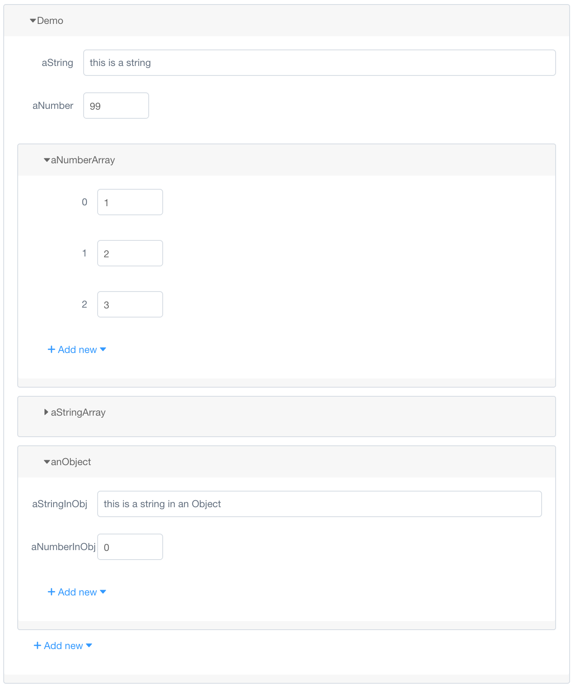

# vue-json-form

[](https://www.npmjs.com/package/vue-json-form)
[](https://www.npmjs.com/package/vue-json-form)
[](https://opensource.org/licenses/MIT)

*In development process.*

A Vue.js component generating form from JSON.

## Installation

```javascript
npm install --save vue-json-form
```

## Usage

In Vue.js:

```html
<template>
  <div>
    <json-form name="JSON Form" v-model="myData">
    </json-form>
  </div>
</template>

<script>
  import JsonForm from 'vue-json-form'

  export default {
    components: {
      JsonForm
    },
    data () {
      return {
        myData: {
          aString: 'this is a string',
          aNumber: 99,
          aNumberArray: [
            1, 2, 3
          ],
          aStringArray: [
            'a', 'b', 'c'
          ],
          anObject: {
            aStringInObj: 'this is a string in an Object',
            aNumberInObj: 0
          },
          aNull: null
        }
      }
    }
  }
</script>

<style scoped>

</style>
```


